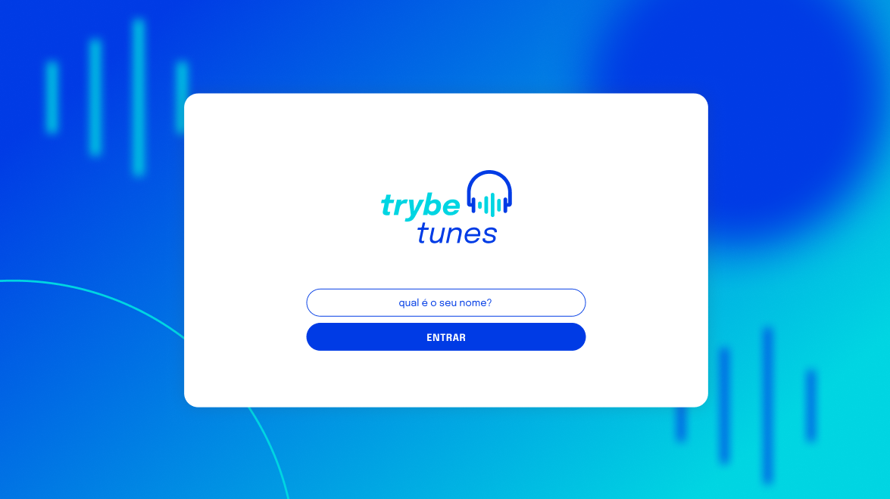
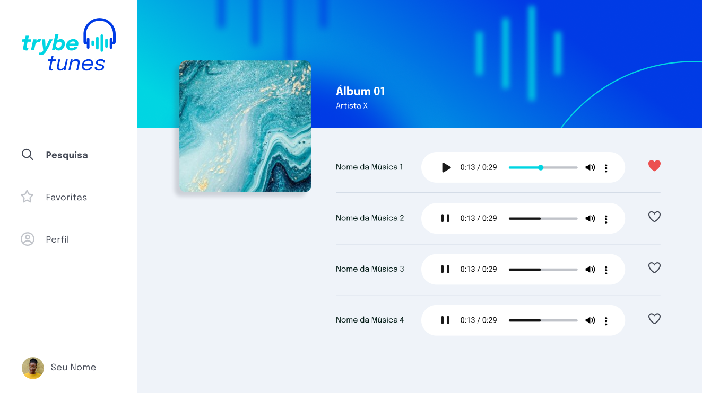

<h1><strong>TrybeTunes</strong></h1>

<h2><strong>Descrição</strong></h2>

  O TrybeTunes é uma aplicação web inspirada em um mini player de música, onde a pessoa usuária consegue
  fazer login, pesquisar por artistas ou bandas, visualizar álbuns, ouvir prévias das músicas, favoritar e desfavoritar faixas,
  acessar a lista de favoritas e gerenciar o próprio perfil (visualização e edição).

<h2><strong>Funcionalidades</strong></h2>
<ul>
  <li align="justify">Fazer login.</li>
  <li align="justify">Pesquisar por uma banda ou um artista.</li>
  <li align="justify">Listar os álbuns disponíveis da banda ou do artista pesquisado.</li>
  <li align="justify">Visualizar as músicas de um álbum selecionado.</li>
  <li align="justify">Reproduzir uma prévia das músicas do álbum.</li>
  <li align="justify">Favoritar e desfavoritar músicas.</li>
  <li align="justify">Ver a lista de músicas favoritadas.</li>
  <li align="justify">Ver o perfil da pessoa logada.</li>
  <li align="justify">Editar o perfil da pessoa logada.</li>
</ul>

<h2><strong>Demonstração do Projeto</strong></h2>

  
  
   
  <a href="https://github.com/williandpg/trybetunes" target="_blank"><strong>Acesse a demonstração</strong></a>

<h2><strong>Tecnologias Utilizadas</strong></h2>
<ul>
  <li align="justify">
    <a href="https://react.dev/" target="_blank"><strong>React</strong></a>:
    Biblioteca para construção da interface e componentização da aplicação.
  </li>
  <li align="justify">
    <a href="https://www.typescriptlang.org/" target="_blank"><strong>TypeScript</strong></a>:
    Tipagem estática para aumentar a segurança e a legibilidade do código.
  </li>
  <li align="justify">
    <a href="https://vite.dev/" target="_blank"><strong>Vite</strong></a>:
    Ferramenta de build e servidor de desenvolvimento rápido.
  </li>
  <li align="justify">
    <a href="https://reactrouter.com/" target="_blank"><strong>React Router</strong></a>:
    Navegação entre páginas e rotas (SPA).
  </li>
  <li align="justify">
    <a href="https://developer.apple.com/library/archive/documentation/AudioVideo/Conceptual/iTuneSearchAPI/index.html" target="_blank"><strong>iTunes Search API</strong></a>:
    Fonte de dados para pesquisa de artistas, álbuns e músicas (prévia de áudio).
  </li>
  <li align="justify">
    <a href="https://eslint.org/" target="_blank"><strong>ESLint</strong></a>:
    Padronização e qualidade de código.
  </li>
  <li align="justify">
    <a href="https://stylelint.io/" target="_blank"><strong>Stylelint</strong></a>:
    Padronização de estilos e boas práticas no CSS.
  </li>
</ul>

<h2><strong>Estrutura do Projeto</strong></h2>

A estrutura do projeto é organizada da seguinte forma:

<pre><code>
/
├── src/
│   ├── components/     # Componentes reutilizáveis
│   ├── images/         # Imagens do projeto
│   ├── pages/          # Páginas da aplicação
│   ├── services/       # Serviços para chamadas de API
│   ├── App.tsx
│   ├── types.ts
│   ├── main.tsx
│   └── index.css
├── index.html
├── package.json
├── package-lock.json
├── setupTests.ts
├── tsconfig.json
├── tsconfig.node.json
├── vite.config.ts
└── README.md
</code></pre>

<h2><strong>Contato</strong></h2>

  <strong>Willian Gonçalves</strong> |
  <a href="https://www.linkedin.com/in/williandpg/" target="_blank"><strong>LinkedIn</strong></a> |
  <a href="https://github.com/williandpg" target="_blank"><strong>Github</strong></a> |
  <a href="https://williandpg.github.io/" target="_blank"><strong>Portfolio</strong></a> |
  <a href="mailto:goncalves.wdp@outlook.com" target="_blank"><strong>Email</strong></a>

<h2><strong>Créditos</strong></h2>

  Este projeto foi desenvolvido como parte do curso de Desenvolvimento Web Full Stack da Trybe, no módulo de Front-end.

  
<strong>English Version</strong>

  <h1><strong>TrybeTunes</strong></h1>

  <h2><strong>Description</strong></h2>
  

    TrybeTunes is a web application inspired by a mini music player. It allows the user to log in,
    search for artists or bands, browse available albums, view tracks, listen to song previews, favorite and unfavorite tracks,
    check the favorites list, and manage the user profile (view and edit).
  

  <h2><strong>Features</strong></h2>
  <ul>
    <li align="justify">Login.</li>
    <li align="justify">Search for an artist or band.</li>
    <li align="justify">List available albums for the searched artist/band.</li>
    <li align="justify">View tracks from a selected album.</li>
    <li align="justify">Play a preview of album tracks.</li>
    <li align="justify">Favorite and unfavorite tracks.</li>
    <li align="justify">View the list of favorited tracks.</li>
    <li align="justify">View the logged in user profile.</li>
    <li align="justify">Edit the logged in user profile.</li>
  </ul>

  <h2><strong>Project Demo</strong></h2>
  

    
     
    <a href="https://github.com/williandpg/trybetunes" target="_blank"><strong>Open demo</strong></a>
  

  <h2><strong>Technologies Used</strong></h2>
  <ul>
    <li align="justify">
      <a href="https://react.dev/" target="_blank"><strong>React</strong></a>:
      Library for building the UI with components.
    </li>
    <li align="justify">
      <a href="https://www.typescriptlang.org/" target="_blank"><strong>TypeScript</strong></a>:
      Static typing to improve code safety and readability.
    </li>
    <li align="justify">
      <a href="https://vite.dev/" target="_blank"><strong>Vite</strong></a>:
      Fast dev server and build tooling.
    </li>
    <li align="justify">
      <a href="https://reactrouter.com/" target="_blank"><strong>React Router</strong></a>:
      SPA navigation and routes.
    </li>
    <li align="justify">
      <a href="https://developer.apple.com/library/archive/documentation/AudioVideo/Conceptual/iTuneSearchAPI/index.html" target="_blank"><strong>iTunes Search API</strong></a>:
      Data source for artists, albums, and music previews.
    </li>
    <li align="justify">
      <a href="https://eslint.org/" target="_blank"><strong>ESLint</strong></a>:
      Code quality and style rules.
    </li>
    <li align="justify">
      <a href="https://stylelint.io/" target="_blank"><strong>Stylelint</strong></a>:
      CSS linting and best practices.
    </li>
  </ul>

  <h2><strong>Project Structure</strong></h2>
  
The project structure is organized as follows:

  <pre><code>
  /
  ├── src/
  │   ├── components/     # Reusable components
  │   ├── images/         # Project images
  │   ├── pages/          # Application pages
  │   ├── services/       # Services for API calls
  │   ├── App.tsx
  │   ├── types.ts
  │   ├── main.tsx
  │   └── index.css
  ├── index.html
  ├── package.json
  ├── package-lock.json
  ├── setupTests.ts
  ├── tsconfig.json
  ├── tsconfig.node.json
  ├── vite.config.ts
  └── README.md
  </code></pre>

  <h2><strong>Contact</strong></h2>
  

    <strong>Willian Gonçalves</strong> |
    <a href="https://www.linkedin.com/in/williandpg/" target="_blank"><strong>LinkedIn</strong></a> |
    <a href="https://github.com/williandpg" target="_blank"><strong>Github</strong></a> |
    <a href="https://williandpg.github.io/" target="_blank"><strong>Portfolio</strong></a> |
    <a href="mailto:goncalves.wdp@outlook.com" target="_blank"><strong>Email</strong></a>
  

  <h2><strong>Credits</strong></h2>
  

    This project was developed as part of Trybe's Full Stack Web Development course, Front-end module.
  

